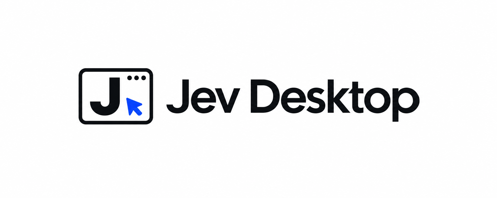

[](https://github.com/jacks3tr/jev-desktop/actions/workflows/ci.yml)
[](LICENSE)
[](pyproject.toml)
[](#requirements)
[](https://github.com/jacks3tr/jev-desktop/releases)

Jev Desktop lets AI agents use Windows applications through MCP or the command line.
Hand off a task and let Jev observe windows, choose controls, type supplied text, and navigate
locally. Your agent gets the result or a request for help instead of handling every click.

## Requirements

- Windows 10 or 11 with an interactive desktop session.
- Python 3.12 or newer.
- A TypeSafe API key when Jev selects controls. Inspection and direct actions need no key.

## Install

From a checkout, run PowerShell:

~~~powershell
python -m venv .venv
.venv\Scripts\Activate.ps1
python -m pip install -e .
jev-desktop doctor
~~~

## Connect your agent

Configure your MCP client to use the Python environment where you installed Jev Desktop:

~~~json
{
  "mcpServers": {
    "jev-desktop": {
      "command": "python",
      "args": ["-m", "jev_desktop.transports.mcp_stdio"]
    }
  }
}
~~~

The [desktop-use skill](skills/desktop-use/SKILL.md) gives agents the operating instructions.
For Jev target selection, supply `TYPESAFE_API_KEY` through the client's environment or
secret settings. The broker does not automatically load dotenv files.

## Use an application

Open Calculator in Standard mode and ask your agent:

> Use Jev Desktop to calculate 7 + 8 with Calculator's buttons and read the result.

Or open a Chrome window you're ready to navigate:

> Use Jev Desktop to open https://example.org through Chrome's address bar.

The agent discovers the application and hands off the goal in one `desktop_run` call. Jev
handles the action loop inside the broker, using structured observations rather than sending
a screenshot to the calling agent after every action.

```json
{
  "task": {
    "goal": "Calculate 7 + 8 using Calculator buttons and stop when the display shows 15.",
    "app_ref": "<from inspection>",
    "window_refs": ["<from inspection>"],
    "max_actions": 8,
    "timeout_seconds": 60
  }
}
```

For tasks that type, supply named exact strings in `texts` and allowed chords in `hotkeys`.
See the [Chrome task](examples/browser.json). Jev returns control when it finishes, needs
judgment or missing input, or reaches a limit. Check the final observation before reporting
success. Tasks report actions, elapsed time, model latency, and reported token usage.

This avoids a calling-model turn per routine action. End-to-end speed and cost savings have
not yet been benchmarked against a general computer-use agent.

| Tool | Purpose |
| --- | --- |
| `desktop_run` | Hand off a bounded task for Jev to carry out locally. |
| `desktop_inspect` | Find applications and inspect windows, controls, or screenshots. |
| `desktop_act` | Direct an individual action when the agent needs control. |
| `desktop_stop` | Stop input or operate the emergency stop. |

Use `jev-desktop run --task examples/browser.json` from the CLI after filling in the
application and window references. Task mode needs a TypeSafe key in the broker environment.

For direct CLI use, discover a window and inspect it:

~~~powershell
jev-desktop --pretty inspect --query Calculator --no-screenshot
jev-desktop --pretty inspect --app-ref <app_ref> --window <window_ref> --no-screenshot
jev-desktop act --operation CLICK --snapshot <snapshot_id> --access-token <access_token> --window <window_ref> --element <element_id>
~~~

Replace the placeholders with returned references. Inspect again after each action.
Actions control your real mouse and keyboard. To stop input immediately:

~~~powershell
jev-desktop stop --emergency
~~~

The broker runs locally. Jev target selection sends scoped application observations to
TypeSafe. Request screenshots only when useful; `--no-screenshot` skips them. See
[data and storage](docs/reference.md#data-and-storage) for retention and privacy details.

## Development

~~~powershell
python -m pip install -e ".[dev]"
python -m ruff format --check .
python -m ruff check .
python -m mypy
python -m pytest tests/unit -q
~~~

These checks do not control the desktop. Live regression tests are opt-in. Keep local records
and private application details in ignored storage such as `.artifacts/`.

The [technical reference](docs/reference.md) covers direct actions and optional workflow
specifications. Keep pull requests focused and describe how you checked the change. Use
[GitHub issues](https://github.com/jacks3tr/jev-desktop/issues) for bugs and feature requests,
and [private vulnerability reporting](https://github.com/jacks3tr/jev-desktop/security/advisories/new)
for security issues. Release notes live in [GitHub Releases](https://github.com/jacks3tr/jev-desktop/releases).

## License

[MIT](LICENSE).
